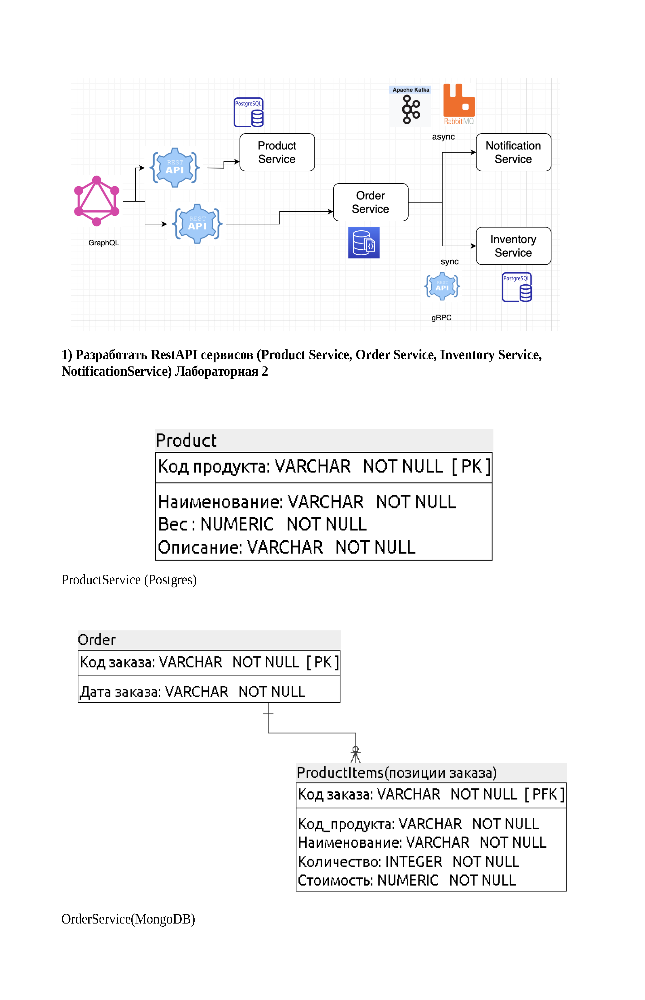
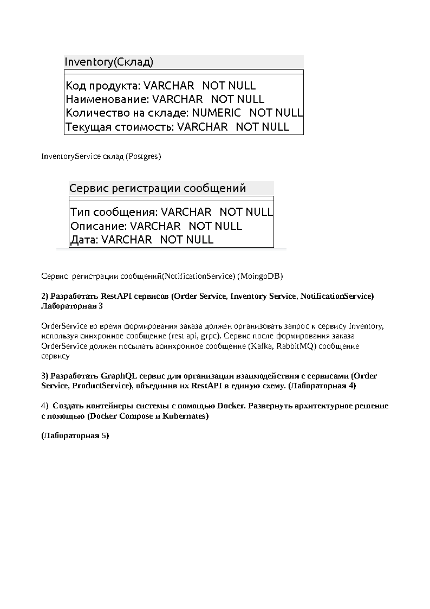

Задания для изучения новых технологий на примере интернет магазина со складом.
Используемый стек технологий: Java 11, Spring Boot, Hibernate, PostgreSQL, MongoDB, Redis, Kubernetes, graphQL, gRPC, Netflix Eureka, Spring Cloud, Kafka.

В этом проекте показаны простые примеры использования вышеперечисленных технологий.

